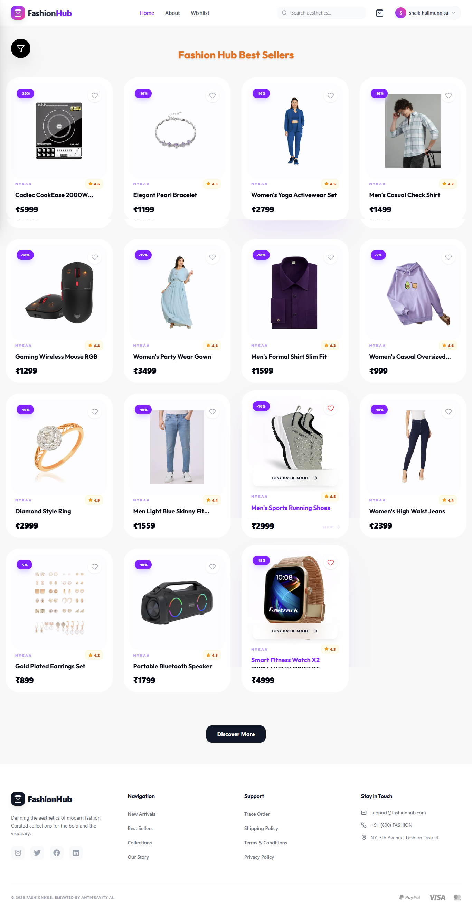
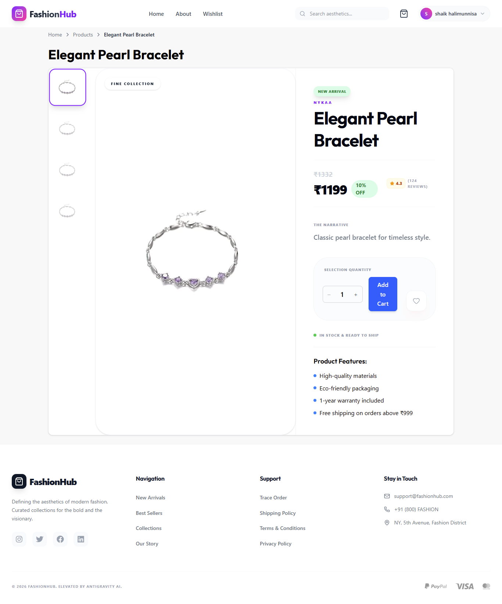
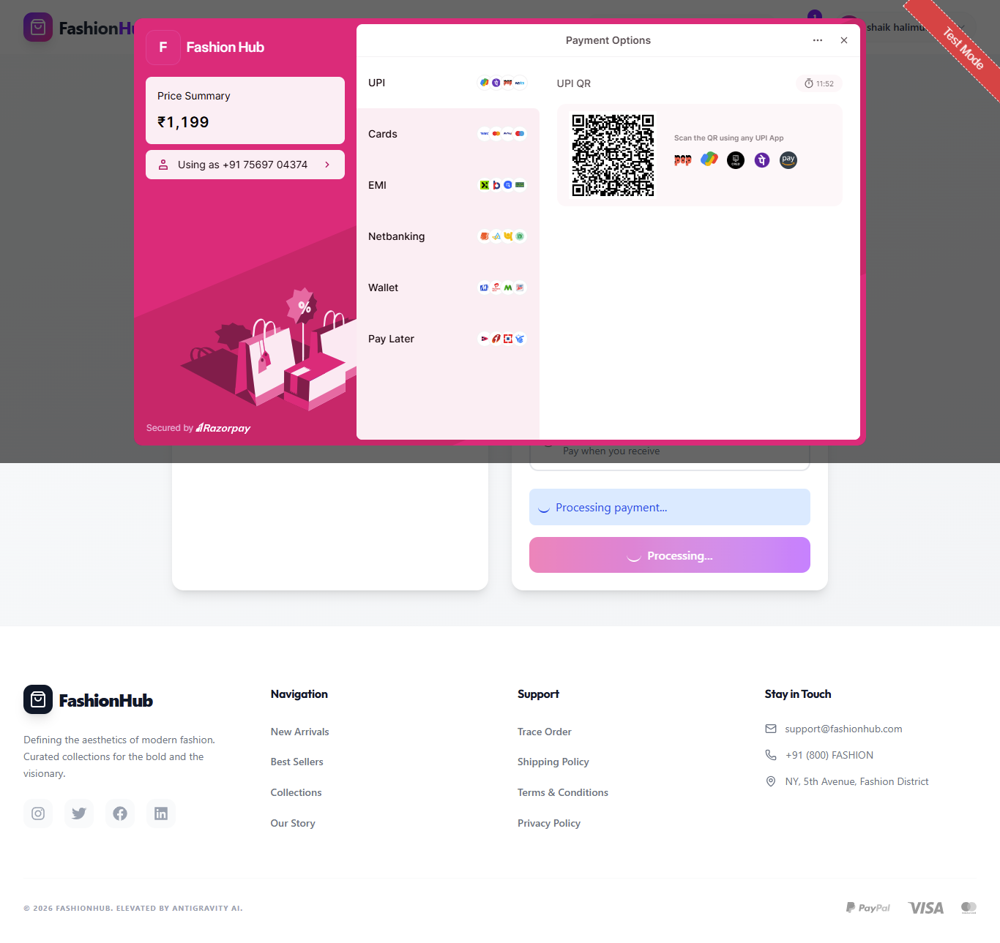

# 🛍️ Scalable Fashion E-Commerce Platform (MERN Stack)

A full-stack **production-oriented e-commerce application** built using the MERN stack. This project focuses not just on features, but on **scalability, secure payments, and real-world architecture design**.

---
## 🚀 Live Demo

- 🌐 Frontend: https://fashion-ecommerce-mern.vercel.app
- 🔗 Backend API: https://fashion-ecommerce-mern.onrender.com 
---

## 🧠 Project Objective

To design and develop a **scalable and secure e-commerce platform** that handles:

* Real-time cart updates
* Secure authentication & authorization
* Payment processing with verification
* Smooth user experience across devices

---

## 🏗️ Architecture Overview

### 🔄 Data Flow

1. User interacts with React frontend
2. API calls are made via Axios
3. Backend (Express) processes requests
4. MongoDB stores/retrieves data
5. JWT used for authentication
6. Razorpay handles payment → backend verifies signature

---

## ⚙️ Tech Stack

### 💻 Frontend

* React (Vite)
* Redux Toolkit (Global State Management)
* Tailwind CSS (UI Styling)
* React Router DOM
* React Hook Form
* Axios

### 🛠️ Backend

* Node.js
* Express.js
* MongoDB (Mongoose)
* JWT Authentication
* bcryptjs (Password Hashing)
* Razorpay (Payment Gateway)
* Nodemailer (Email Service)

---

## 🔐 Authentication System

* JWT-based authentication
* Protected routes using middleware
* Password hashing with bcrypt
* Token validation for every secure API

---

## 🛒 Cart & State Management

* Centralized cart state using Redux Toolkit
* Optimistic UI updates for better UX
* Persistent cart using localStorage

---

## 💳 Payment Flow (Razorpay Integration)

1. User clicks “Place Order”
2. Backend creates Razorpay order
3. Frontend opens Razorpay checkout
4. Payment completed by user
5. Backend verifies signature
6. Order stored in database

---

## 📦 API Design

* RESTful API structure
* Proper route separation (auth, cart, payment, orders)
* Centralized error handling
* Input validation

---

## ⚡ Performance & Scalability Considerations

* Lazy loading components (React)
* Efficient state updates using Redux Toolkit
* Backend structured for horizontal scaling
* API response optimization

---

## 🧪 Challenges & Solutions

### 1. Payment Verification Issue

* Problem: Payment success without backend confirmation
* Solution: Implemented Razorpay signature verification

### 2. Cart State Sync Issue

* Problem: Cart resetting on refresh
* Solution: Persisted cart using localStorage

### 3. Duplicate API Calls

* Problem: Multiple requests triggered unintentionally
* Solution: Optimized component lifecycle & API handling

---

## 📸 Screenshots
 





---

## 📂 Project Structure

```
📦 root
 ┣ 📂 fashion-ecommerce-app (React + Vite)
 ┃  ┣ 📂 src
 ┃  ┗ 📜 package.json
 ┃
 ┗ 📂 my-backend-app (Node + Express)
    ┣ 📂 controllers
    ┣ 📂 routes
    ┣ 📂 models
    ┗ 📜 app.js
```

---

## 🛠️ Setup Instructions

### Backend

```bash
cd my-backend-app
npm install
npm run dev
```

### Frontend

```bash
cd fashion-ecommerce-app
npm install
npm run dev
```

---

## 🔑 Environment Variables

```env
JWT_SECRET=your_secret
RAZORPAY_KEY_ID=your_key
RAZORPAY_KEY_SECRET=your_secret
DB_URI=your_mongodb_uri
EMAIL_USER=your_email
EMAIL_PASS=your_password
```

---

## 📌 Key Highlights

* Secure payment integration
* Scalable backend structure
* Clean UI with responsive design
* Real-world project architecture

---

## 🧠 What I Learned

* Handling real payment gateway workflows
* Managing global state efficiently
* Designing scalable backend APIs
* Debugging async operations

---

## 📜 License

ISC License
